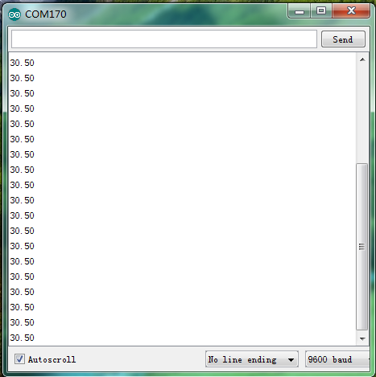

# Arduino


## 1. Arduino简介  

Arduino是一款开源电子原型平台，广泛用于构建互动项目。它由硬件和软件组成，硬件包括多种型号的开发板（如Arduino UNO、MEGA等），而软件主要是Arduino IDE，用于编写和上传代码。Arduino编程基于C/C++语言，语法简单易懂，特别适合初学者。通过各种传感器和模块，Arduino能够实现从基本的LED闪烁到复杂的自动化控制等多种应用。其社区的支持和丰富的资源，使得Arduino成为教育和DIY项目的理想选择。  

## 2. 连接图  

  

## 3. 测试代码  

```cpp  
// 库文件下载链接：http://www.pjrc.com/teensy/arduino_libraries/OneWire.zip  

#include <OneWire.h>  

int DS18S20_Pin = 3; // 定义数字口3  
OneWire ds(DS18S20_Pin);  

void setup(void) {  
    Serial.begin(9600); // 设置波特率  
}  

void loop() {  
    float temperature = getTemp(); // 调用函数计算温度值  
    Serial.println(temperature); // 显示温度值，并自动换行  
    delay(100); // 延迟0.1S   
}  

float getTemp() {  
    // returns the temperature from one DS18S20 in DEG Celsius  
    byte data[12];  
    byte addr[8];  

    if (!ds.search(addr)) {  
        // no more sensors on chain, reset search  
        ds.reset_search();  
        return -1000;  
    }  
    
    if (OneWire::crc8(addr, 7) != addr[7]) {  
        Serial.println("CRC is not valid!");  
        return -1000;  
    }  
    
    if ((addr[0] != 0x10) && (addr[0] != 0x28)) {  
        Serial.print("Device is not recognized");  
        return -1000;  
    }  

    ds.reset();  
    ds.select(addr);  
    ds.write(0x44, 1); // start conversion, with parasite power on at the end  
    byte present = ds.reset();  
    ds.select(addr);  
    ds.write(0xBE); // Read Scratchpad  

    for (int i = 0; i < 9; i++) { // we need 9 bytes  
        data[i] = ds.read();  
    }  

    ds.reset_search();  
    byte MSB = data[1];  
    byte LSB = data[0];  
    float tempRead = ((MSB << 8) | LSB); // using two's complement  
    float TemperatureSum = tempRead / 16;  
    return TemperatureSum;  
}  
```  

## 4. 测试结果  

按照上图接好线，烧录好代码，上电后，通电后，您可以在软件串口监视器中看到当前环境温度值，如下图所示。  

  

## 5. 相关库文件链接地址  

[OneWire库文件下载链接](https://pan.baidu.com/s/1NUA1FUDxnSidQypRfWTslg)  
提取码：e85o


