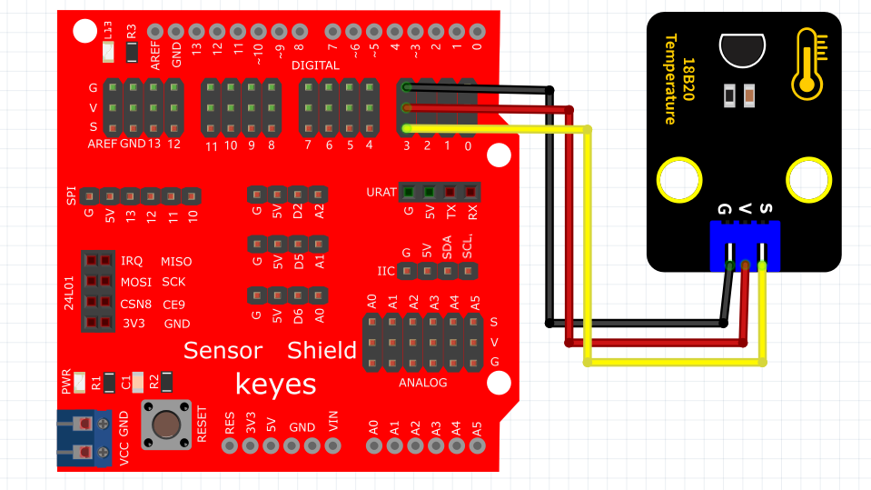

# KidsBlock

## 1. KidsBlock简介  

KidsBlock是一款旨在帮助儿童和初学者学习编程的图形化编程工具。它通过直观的拖放式界面，让用户可以轻松地创建互动项目，尤其适用于Arduino等硬件平台。KidsBlock支持各类项目的开发，如传感器项目、机器人控制等，具有丰富的模块库和示例，适合初学者和教育工作者使用。该工具鼓励孩子们通过实践来学习编程和电子技术，有助于发展他们的创造力和解决问题的能力。  

## 2. 连接图  

  

## 3. 测试代码  

1. 添加18B20的代码块，然后在事件里拖出Arduino启动模块。  
   
     
     

2. 在串口栏拖出设置串口波特率模块并设置波特率为9600。  
   
     

3. 在控制栏拖出重复执行模块。  
   
     

4. 在串口栏拖出串口打印模块；拖出18B20读取温度模块设置引脚为3并添加到串口打印模块上。  
   
     

5. 在控制栏拖出延时模块并设置延时为100ms。  
   
     

## 4. 测试结果  

按照上图接好线，烧录好代码，上电后，您可以在软件串口监视器中看到当前环境温度值，如下图所示。  

