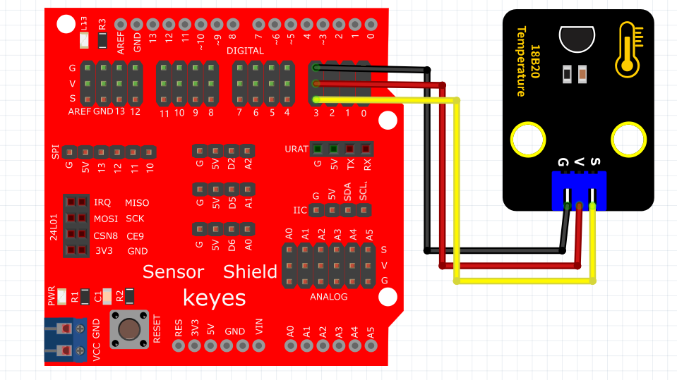
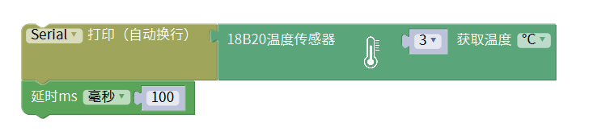
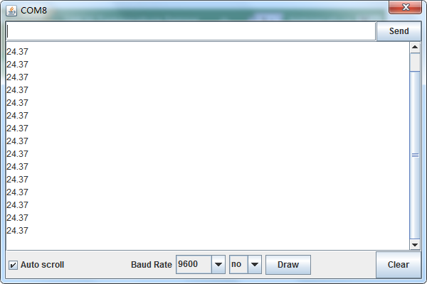

# Mixly

## 1. Mixly简介  

Mixly是一款图形化的编程工具，旨在让初学者和儿童更容易理解编程和电子原理。它通过简单易用的拖拽式界面，支持生动的互动式编程体验，适用于多种硬件平台，包括Arduino。用户可以利用Mixly设计和实现各种项目，例如传感器应用、机器人控制等。此工具强调通过实践学习编程概念，使用户能够在有趣的实验和构建项目中获得编程技能。Mixly还具有开放源代码和丰富的社区支持，帮助用户解决疑难问题。  

## 2. 连接图  

  

## 3. 测试代码  

  

## 4. 测试结果  

按照上图接好线，烧录好代码，上电后，您可以在软件串口监视器中看到当前环境温度值，如下图所示。  

