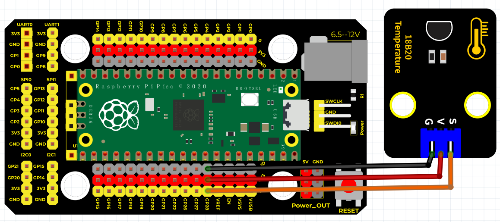
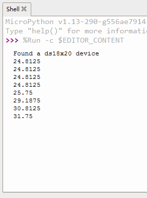

# Python


## 1. Python简介  

Python是一种高级编程语言，以其清晰、易读的语法和强大的功能而著称。它支持多种编程范式，包括面向对象、命令式和函数式编程，因而广泛应用于网站开发、数据分析、自动化脚本、人工智能和科学计算等多个领域。Python具有丰富的标准库以及众多第三方库，使得开发者可以轻松实现复杂的功能。同时，Python的社区活跃，拥有大量教育资源，尤其适合编程学习者。Python被誉为“初学者的编程语言”，众多教育机构选用它作为教学语言。  

## 2. 连接图  

  

## 3. 测试代码  

```python  
import machine, onewire, ds18x20, time  

ds_pin = machine.Pin(28)  # 定义DS18B20引脚  

ds_sensor = ds18x20.DS18X20(onewire.OneWire(ds_pin))  

roms = ds_sensor.scan()  # 扫描是否存在DS18B20设备  

print('Found a ds18x20 device')  

# 循环函数  
def makerobo_loop():  
    while True:  
        ds_sensor.convert_temp()  
        time.sleep_ms(750)  
        for rom in roms:  
            print(ds_sensor.read_temp(rom))  # 打印出温度值  
        time.sleep(2)  # 延时2s时间  

# 程序入口  
if __name__ == '__main__':  
    makerobo_loop()  # 调用循环函数  
```  

## 4. 测试结果  

按照上图接好线，烧录好代码，上电后，您可以在软件串口监视器中看到当前环境温度值，如下图所示。  




